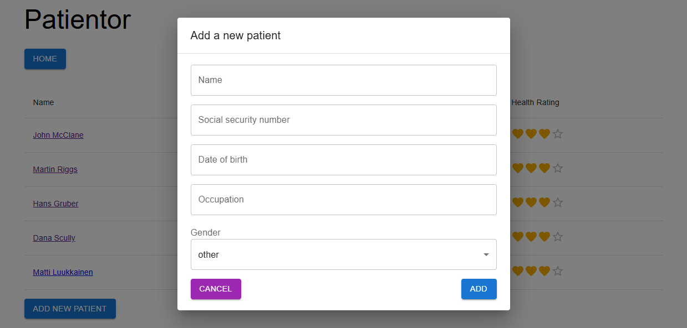

# Patientor backend:<br> Практический проект на Express.js, TypeScript

URL: [https://patientor-react.vercel.app](https://patientor-react.vercel.app/)
<br>
FRONTEND: [https://github.com/arshtnkv/patientor-react](https://github.com/arshtnkv/patientor-react/)



## Описание:

Простое приложение ведения медицинских карт для врачей, занимающихся диагностикой и обработкой основной медицинской информацией своих пациентов.

Основной упор на оттачивание навыков по TypeScript для серверной части приложения.

##

### Технологии:

- Express.js
- TypeScript
- Zod
- Uuid
- ESLint
- Prettier

### Основные команды:

- Установка зависимостей

```
npm install
```

- Запуск локального сервера

```
npm run dev
```

- Запуск ESLint

```
npm run lint
```
